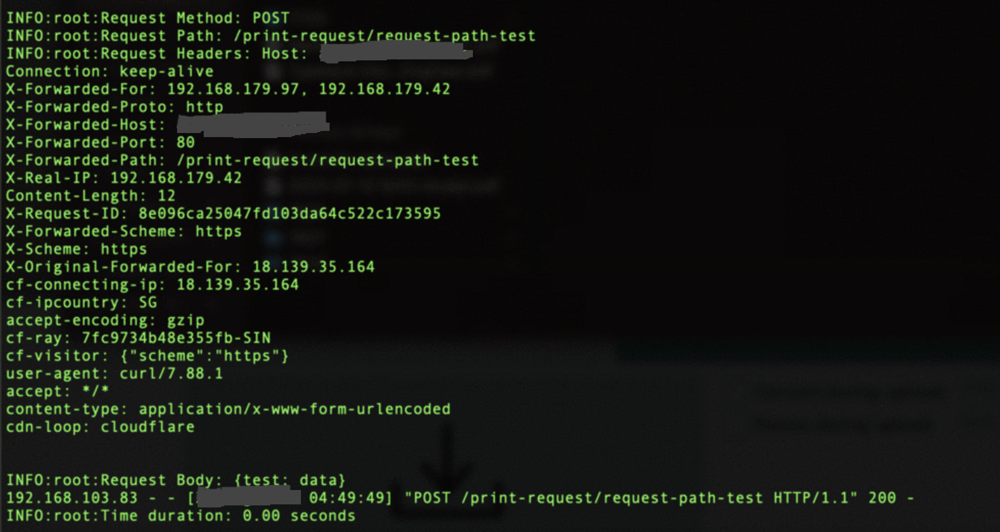

# kube-debug-image

Lightweight Image to inspect request data/headers and debug network related issues in kubernetes environment.

## Prerequisites

Make sure there is no other container running with label app=print-request-v1 you can check by 

```cmd
kubectl get all -l app=print-request-v1
```

make sure result is "No resources found in default namespace."

## Installation

1) Set env variable for ingress hostname and ingress class here we are taking google.com and nginx as example

```cmd
export ING_HOST=google.com
export ING_CLASS=nginx
```

2) Install by creating specific kubernetes resources by executing install.sh or running  following commands

```cmd
kubectl run print-request --image=reaper7/print-request:v1 -l app=print-request-v1  --env="HTTP_SERVER_TIMEOUT=0"
kubectl expose pod print-request --port=3000 --name=print-request -l app=print-request-v1
kubectl create ing print-request --rule="${ING_HOST}/print-request*=print-request:3000" --class="${ING_CLASS}"
```

## How to use


1) Installation will expose an Http endpoint at http://hostname/print-request 

Any request on this endpoint will be logged with all it's headers and request data, and application will return response "Hello World!" 

Example 

curl -X POST https://${ING_HOST}/print-request/request-path-test --data "{test: data}"

Above request will be logged as showed in image below.



Check logs with below command 

```cmd
kubectl logs -f -l app=print-request-v1 
```

Note: You can Adjust response time to debug network issues by setting HTTP_SERVER_TIMEOUT env variable in container, It can be set at startup or dynamically at runtime.

2) Addition to this, Image has preinstalled network utilities and db clients for Mysql, postgres and mongo tools that can be access via exec into the pod

```cmd
kubectl  exec -it print-request sh 
```

## Uninstallation 

Run uninstall.sh or following commands to delete the resources. 

```cmd
kubectl delete all -l app=print-request-v1
kubectl delete ing print-request
```
